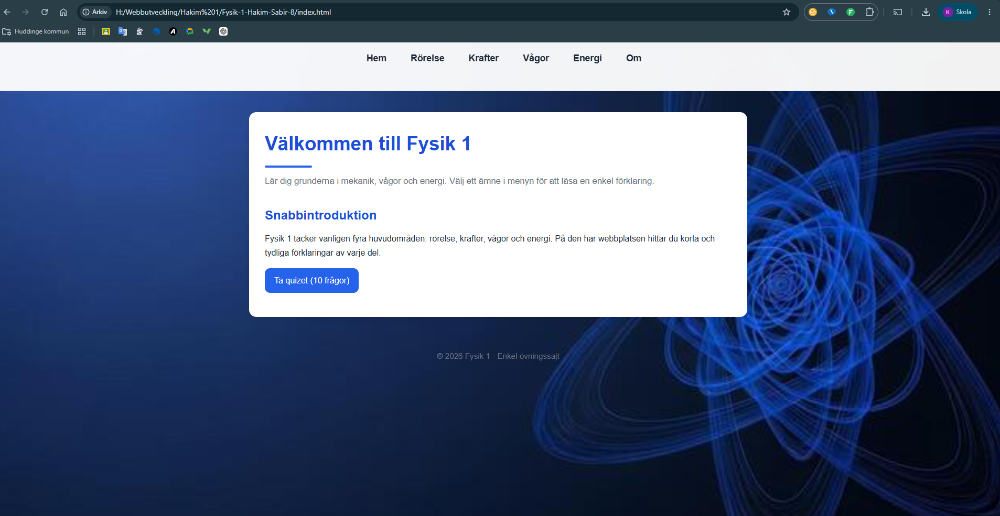
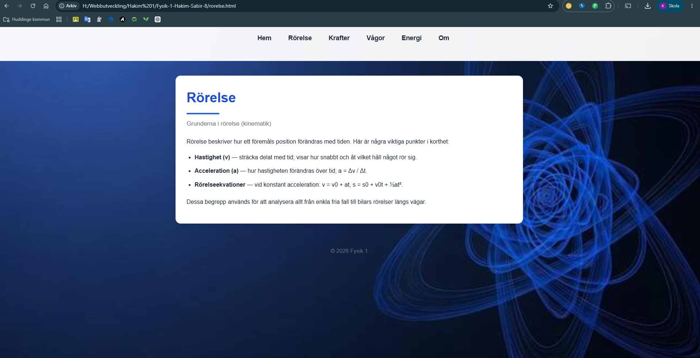
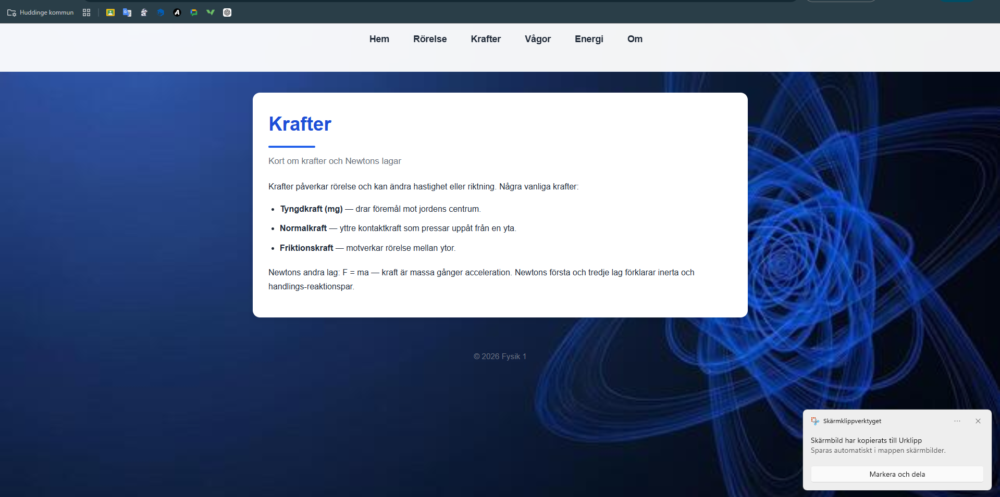
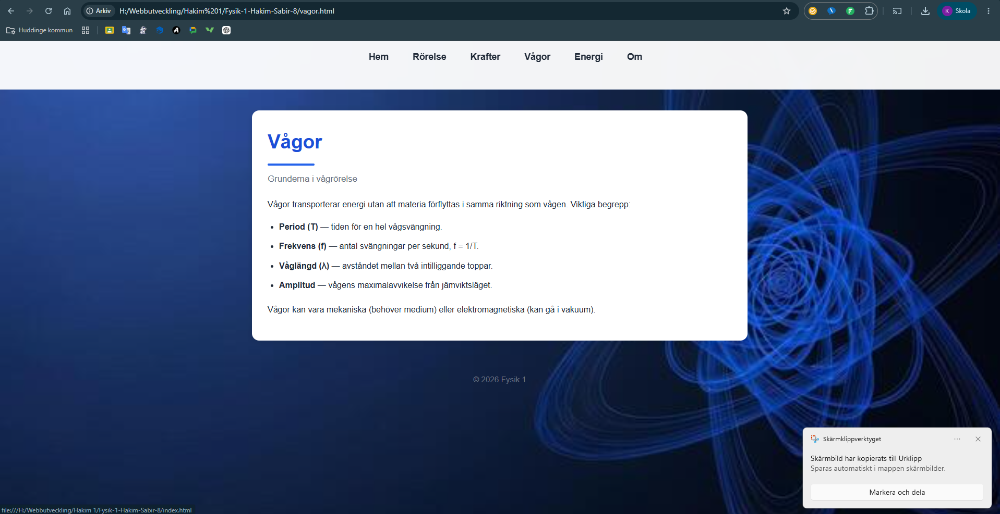
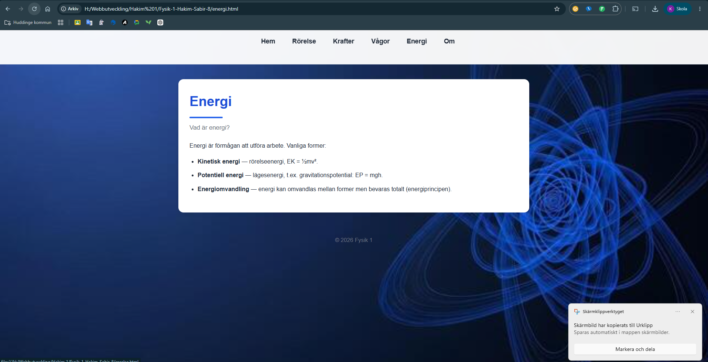
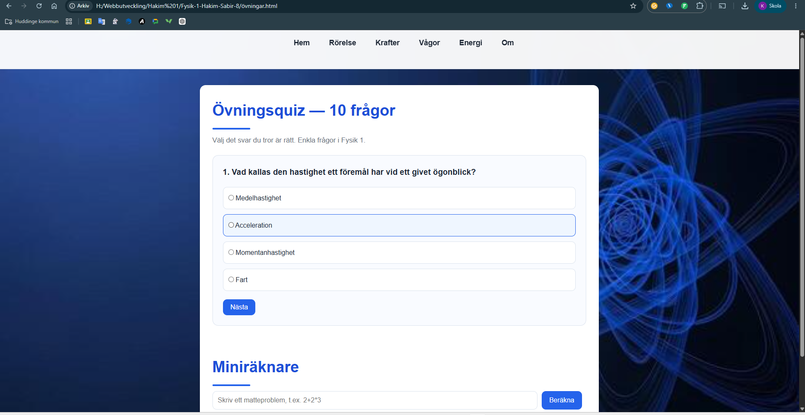
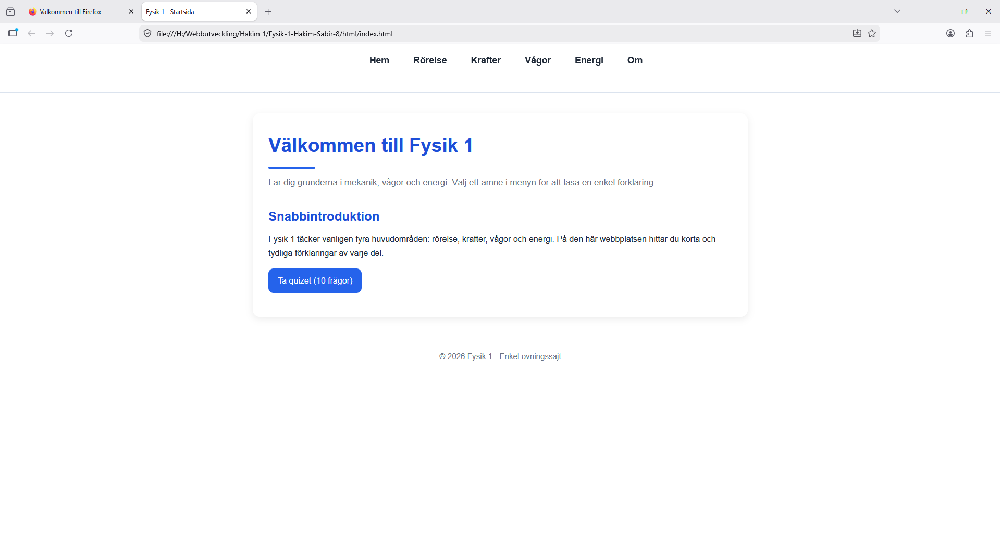
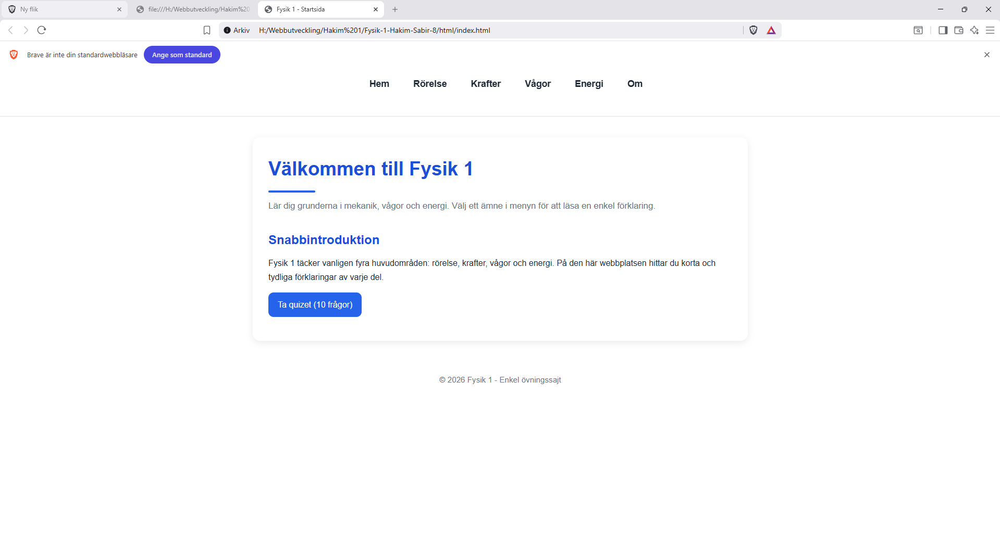
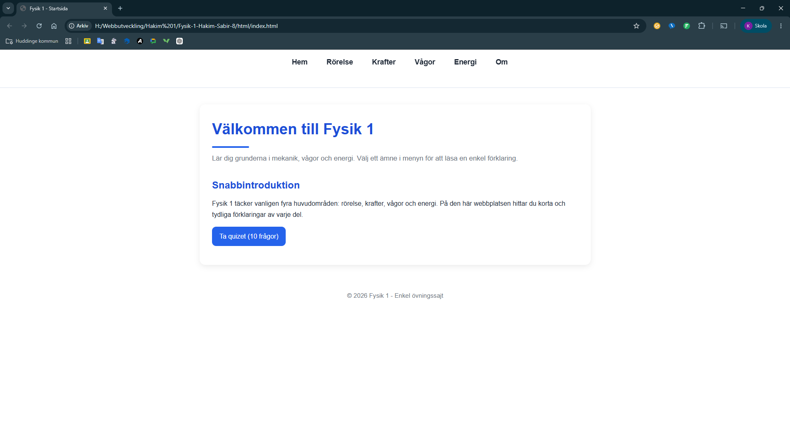
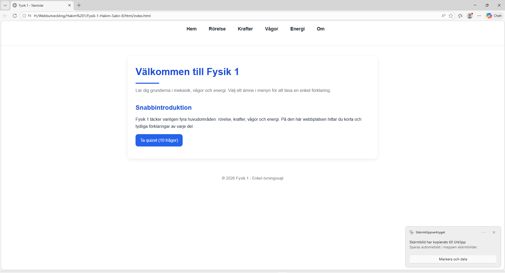

# Fysik 1 Hemsida

Det här projektet är en hemsida om Fysik 1 som är skapad med HTML, CSS och JavaScript. Syftet med hemsidan är att göra grundläggande fysik enklare att förstå genom korta förklaringar, tydlig design och interaktiva funktioner. 
Hemsidan är uppdelad i flera olika sidor där varje sida fokuserar på ett område inom Fysik 1. Informationen är skriven på ett enkelt sätt för att fungera som repetitionsmaterial eller stöd under kursen. 
Projektet är också gjort för att träna på webbutveckling och hur man bygger upp en hemsida med flera sidor, navigation, styling och JavaScript-funktioner.

# Startsida

Startsidan fungerar som en introduktion till hemsidan. Där får användaren en kort förklaring av vad webbplatsen handlar om och vilka områden inom fysik som tas upp. På startsidan finns även en knapp som leder vidare till quizet.

;

# Rörelse

Sidan om rörelse förklarar grunderna inom kinematik. Där finns information om bland annat: 
- Hastighet 
- Acceleration 
- Rörelseekvationer 
Sidan beskriver hur föremål rör sig och hur man kan använda fysik för att analysera rörelser i vardagen.

;

# Krafter

På sidan om krafter finns förklaringar om olika typer av krafter och Newtons lagar. 
Exempel på krafter som tas upp: 
- Tyngdkraft 
- Normalkraft 
- Friktionskraft 
Sidan förklarar också hur krafter påverkar rörelse och acceleration.

;

# Vågor

Sidan om vågor handlar om grunderna inom vågrörelse och hur energi transporteras genom vågor. 
Begrepp som förklaras: 
- Frekvens 
- Period 
- Våglängd 
- Amplitud 
Det finns även information om skillnaden mellan mekaniska och elektromagnetiska vågor.

;

# Energi

Energisidan beskriver olika former av energi och hur energi kan omvandlas mellan olika former. 
Exempel på energi som tas upp: 
- Kinetisk energi 
- Potentiell energi 
- Energiomvandling 
Sidan förklarar också energiprincipen och hur energi bevaras.

;

# Quiz och miniräknare

På hemsidan finns ett quiz med 10 frågor inom Fysik 1. Quizet är gjort med JavaScript och låter användaren testa sina kunskaper direkt på sidan. 
Efter att quizet är klart visas resultatet automatiskt. 
Det finns även en enkel miniräknare där användaren kan skriva in matematiska uttryck och få fram svar direkt.

# Manuella Tester

Jag öppna den på:
- Firefox   ;
- Brave     ;
- Chrome    ;
- Edge      ;

